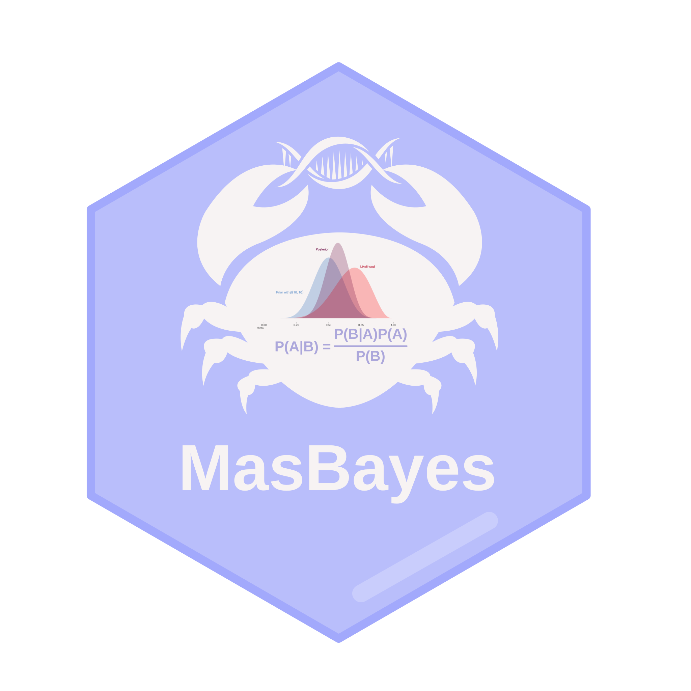
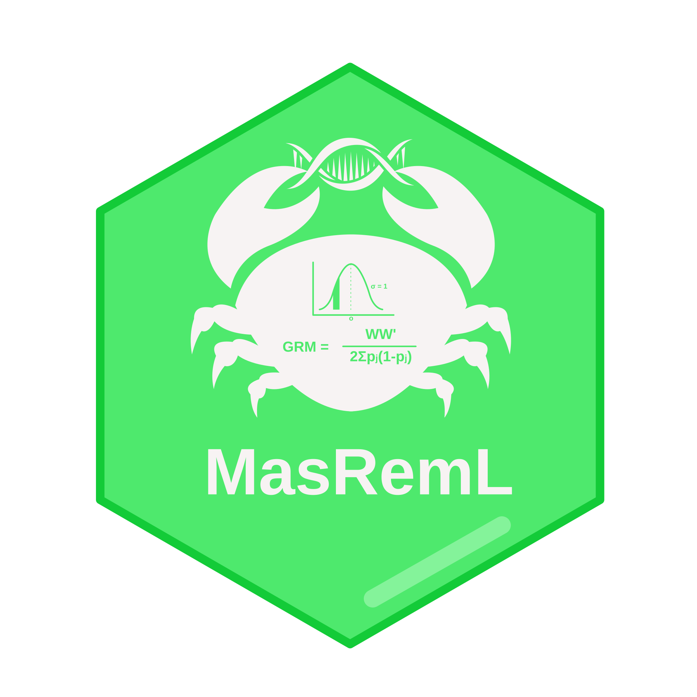

:::::::: hero-banner
::: hero-badges

:::

::::: hero-cards
::: hero-card
{.hero-logo}

[MasBayes GitHub ↗](https://github.com/bowo1698/masbayes){.hero-github}
:::

::: hero-card
{.hero-logo}

[MasRemL GitHub ↗](https://github.com/bowo1698/masreml){.hero-github}
:::
:::::

::: hero-tagline
**Two R packages, one Rust backend.** SNP + microhaplotype markers, REML
and Bayesian estimators, continuous and binary traits, all through a
single API surface.
:::
::::::::

## Welcome

MasBayes and MasRemL were developed to make genomic prediction more
flexible and reproducible. These packages support multiple methods,
including REML-BLUP for frequentist-based methods and the Bayesian alphabet for
Bayesian statistical methods. The packages also work with two marker types (**SNPs**
and **microhaplotypes**) and can analyse both **continuous** and
**binary** traits.

All features are integrated into a single R environment with the Rust
backend, shared demo datasets, and a consistent API. This allows the
same analysis pipeline to run from start to finish without changing
tools, programming languages, or input formats during the analysis.

{fig-align="center" width="80%"}

::: callout-note
## Motivation

Over the last few years, many great scientists have developed outstanding
algorithms, prediction models, etc, but often rare of them
share the source codes directly for reproducible analysis. Hence, this
project is open source and free, so anyone can reproduce the same results,
as well as providing evaluation and improvement for MasBayes and MasRemL. 
Through this project, we also plan to develop more
prediction models and algorithms within the two frameworks, BLUPs &
Bayesian, to answer current challenges in genomic selection, such as genetic
marker relevance, EBV calculation for cross population or generation, and GxE interaction.
:::

::: callout-note
## Why do we use Rust?

The lead developer has only been learning and implementing Rust for over four years,
mostly for the backend of websites or desktop applications, and yes, this is the
largest Rust project we have ever built for the purpose of end-to-end genomic
selection, specifically based on multi-allelic markers. Indeed, Rust is not
widely used as a backend for many current R packages (most use C++), but this
is a good opportunity to introduce Rust as a memory-safe programming language
for processing large genomic datasets.

Within the MasBayes or MasRemL, all heavy numerical operations, such as variance component estimation, Gibbs
sampling, and solving linear algebra in a dense matrix, are calculated
within the Rust kernel, while you only face the R frontend with very
simple syntax. The concept of ownership from Rust ensures that you can
calculate all of those heavy operations without wasting computing
resources. This is our motivation to build a system that enables anyone
with limited computational resources to learn and use genomic tools for
selective breeding in a very efficient way.

See [Installation](installation/index.qmd) for how to set up Rust and
both packages on Linux, macOS, and Windows.
:::

## Where to go next

| You are... | Start here |
|------------------------------------|------------------------------------|
| Setting up for the first time | [Installation](installation/index.qmd) |
| Looking for code examples | [Tasks → Genomic Prediction](tasks/genomic-prediction/index.qmd) |
| Looking for input-data formats and the bundled demo | [Input Data](input-data/index.qmd) |
| Looking for function docs | [Reference → masreml](reference/masreml/index.qmd) · [masbayes](reference/masbayes/index.qmd) |
| Curious about the Rust internals | [Internals](internals/index.qmd) |

::: {.callout-note appearance="minimal"}
## **Contact**

Lead developer & maintainer: Agus Wibowo

Email: aguswibowo1698\@gmail.com or agus.wibowo\@my.jcu.edu.au

GitHub Repository: <https://github.com/bowo1698?tab=repositories>
:::

## Citation

If you use these packages, please cite — see
[CITATION](https://github.com/bowo1698/masgenomics-docs/blob/main/CITATION.bib).
