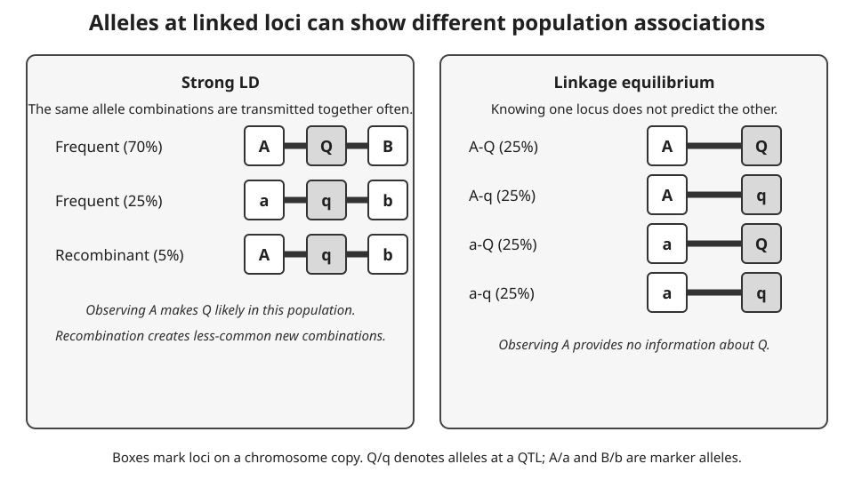

A marker can help predict a trait even when the marker itself does not alter
the trait. If a marker allele is repeatedly inherited with an allele at a
nearby **[quantitative trait locus
(QTL)](https://doi.org/10.1038/nrg2612)**, the marker records part of the
chromosome segment that carries the QTL. This information is created and
eroded through meiosis and population history. The [meiosis
section](genetic-fundamentals.qmd#meiosis) introduced crossing-over; here the
focus is how crossing-over affects pairs of loci rather than the stages of
cell division.

## QTLs locate trait-associated variation

A QTL is a genomic region in which genetic variation contributes to variation
in a **quantitative trait**, such as body weight, growth rate, milk yield, or
another trait measured on a numerical scale. Quantitative traits commonly
reflect contributions from multiple genomic regions and from environmental
conditions. A QTL therefore does not mean that one gene, one allele, or one
marker fully determines the trait. It identifies a region whose inherited
variation helps explain differences in the trait within the population and
study design being considered.

Mapping a QTL usually localises a signal rather than observing its biological
cause directly. If alleles in a chromosome segment are associated with trait
differences, the causal variant may lie in that segment, but so may many
correlated variants. The width of the reported QTL region depends on the
number and location of recombination events, marker density, sample size,
allele frequencies, and LD in the mapped population. More recombination and
more informative observations can narrow a region, but association alone does
not establish the causal gene, variant, molecular mechanism, or favourable
allele.

Three roles should remain separate. A causal variant changes a biological
process relevant to the trait. A QTL is the mapped region that contains, or
is associated with, one or more causal variants. A molecular marker is an
observed genomic position used to track inheritance. A marker can tag a QTL
through LD without being causal. In the recurring project data, the identity
of 20 causal SNPs is known because the data were simulated; ordinary marker
data do not normally reveal that simulation-only information.

## Recombination separates loci at different rates

During **[crossing-over](https://www.genome.gov/genetics-glossary/Crossing-Over)**,
homologous chromosomes exchange corresponding DNA segments. A crossover
between two loci can put alleles that were on the same parental chromosome
onto different chromatids. A gamete is *recombinant* for a pair of loci when
it carries an allele combination that differs from either parental
combination. The **[recombination fraction](https://www.ncbi.nlm.nih.gov/books/NBK19720/)**,
usually written $c$, is the proportion of informative gametes that are
recombinant for that pair.

Three distances describe related but different quantities. **Physical
distance** is the separation along the DNA sequence, measured in base pairs
(bp). **Genetic distance** is a map distance inferred from recombination,
often reported in centimorgans (cM). For short intervals, one cM corresponds
approximately to a 1% recombination fraction. The recombination fraction is
an observed probability, bounded above by 0.5, because loci that recombine
often are indistinguishable from loci that assort independently when only the
two-locus gamete classes are counted.

Physical proximity often leaves less DNA in which a crossover can separate
two loci, so nearby loci tend to have lower recombination fractions than
distant loci on the same chromosome. The relationship is not constant across
a chromosome or across sexes and populations. Recombination hotspots and
coldspots make genetic distance expand or contract relative to physical
distance, and multiple crossovers can restore the parental arrangement. A
base-pair distance is therefore not enough to determine a genetic-map
distance or a recombination fraction.

Two loci are **[linked](https://www.ncbi.nlm.nih.gov/books/NBK26840/)** when
they occur on the same chromosome and have a recombination fraction below
0.5. Linkage is a property of their chromosomal arrangement and meiotic
transmission. It does not by itself say how often particular alleles occur
together in a breeding population.

## Linkage disequilibrium is a population association

Consider alleles $A/a$ at one locus and $B/b$ at another. If the frequency
of the chromosome combination $AB$ equals the product of the separate allele
frequencies, $p_{AB}=p_Ap_B$, the two loci are in **[linkage
equilibrium](https://www.ncbi.nlm.nih.gov/books/NBK232608/)**. Under this
population description, knowing the allele at one locus gives no information
about the allele at the other. A departure from that product is **[linkage
disequilibrium (LD)](https://pmc.ncbi.nlm.nih.gov/articles/PMC5124487/)**:
some allele combinations occur more or less often than expected from the
single-locus frequencies.

In everyday breeding language, strong LD means that alleles at two or more
loci are almost always transmitted together in the population being studied.
More precisely, the allele combination occurs much more often than expected
from the separate allele frequencies. The left panel of @fig-ld-principle
shows this situation: observing marker allele $A$ makes QTL allele $Q$ likely
because the $A$-$Q$ combination is common, while recombinant combinations
are rare. LD can also be weak. The right panel shows linkage equilibrium,
where observing $A$ gives no information about whether the other locus
carries $Q$ or $q$.

{#fig-ld-principle
fig-align="center" width="960" .scientific-illustration
fig-alt="Two panels compare chromosome haplotype frequencies. In strong linkage disequilibrium, A-Q-B and a-q-b combinations are common and recombinant combinations are rare. In linkage equilibrium, all four two-locus combinations are equally frequent."}

Linkage and LD are therefore not synonyms. Linked loci can be in linkage
equilibrium after enough recombination and mixing. Conversely, loci that are
far apart, or even on different chromosomes, can show LD after admixture,
drift, selection, or recent shared ancestry. The term *linkage equilibrium*
is historical: it describes allele association, not whether loci are on the
same chromosome.

The **LD phase** identifies which allele combinations are overrepresented.
If $AB$ and $ab$ occur together more often than expected, the association is
in coupling phase; if $Ab$ and $aB$ are overrepresented, it is in repulsion
phase. Coding one allele rather than the other changes the sign used to
describe the association, but does not change the underlying chromosome
patterns. The next page develops haplotypes and phase in more detail.

Recombination tends to break down LD because it creates new combinations of
alleles. In a simple randomly mating population with no other forces, each
generation reduces a two-locus LD departure by a factor related to the
recombination fraction. This tendency is called **LD decay**. It is not a
universal clock. Mutation introduces new alleles; genetic drift can create
or retain associations by chance; admixture combines populations with
different allele and haplotype frequencies; and selection can increase an
association when particular combinations leave more descendants. Population
size, mating design, bottlenecks, and the time since those events also shape
the observed pattern.

These histories matter in genomic prediction. A marker may track a nearby
QTL in one population because their alleles share an LD phase, then become a
weak predictor in another population or a later generation after the phase
has changed. Marker-QTL association is evidence about inherited chromosome
segments, not proof that the marker is causal.

## An empirical LD map from wheat

LD is often displayed as a triangular heatmap in which each cell represents a
pairwise comparison among markers in one genomic interval. @fig-dadshani-ld
shows how an LD map can diagnose a marker whose physical position is likely
wrong. In the wheat study, panels A and C show a marker assigned to chromosome
1A that has low LD with its nearby markers. After remapping it to chromosome
1B, panels B and D place the same marker, marked by an asterisk, within a
local block of high LD. The figure uses colour to encode $R^2$, but the panel
labels, chromosome names, and asterisk identify the comparison described
here. This is evidence about marker position and population association, not
proof that the highlighted marker is causal for a trait.

, Figure 1, [CC BY 4.0](https://creativecommons.org/licenses/by/4.0/); unchanged.](../../assets/linkage-recombination-ld/dadshani-2021-ldheatmap.png){#fig-dadshani-ld
fig-align="center" width="1200" .scientific-illustration
fig-alt="Four panels compare a wheat marker before and after LD-based remapping. A and C show the marker on chromosome 1A; B and D show it on chromosome 1B. An asterisk identifies the marker, and the lower panels contain triangular LD heatmaps."}

## Tools for inspecting LD

**[Haploview](https://www.broadinstitute.org/haploview/browsing-linkage-disequilibrium)**
is a desktop tool that can display a triangular LD plot after genotype or
HapMap data are loaded. A reader can inspect the pairwise statistics in an
individual cell, view a marker name and minor-allele frequency, and zoom when
many markers are present. The display is useful for exploring a dataset, but
the choice of LD statistic, marker filters, population, and genomic build
must still be reported because each affects interpretation. Other software,
including PLINK and TASSEL, can calculate related summaries. The compact
example below uses **[LDheatmap](https://sfustatgen.github.io/LDheatmap/)**,
an R package that draws a pairwise-LD matrix alongside marker positions.

The `GIMAP5.CEU` example bundled with the package contains genotypes for 116
HapMap CEU individuals at 23 SNPs around the *GIMAP5* region on chromosome 7.
It provides a denser local pattern than the small project subset used below.
Here, `LDheatmap` calculates pairwise $r^2$ directly from the genotype matrix
and places the result against physical marker positions. This is a realised
association in one human population; it is neither a phased-haplotype
calculation nor an estimate of recombination. The package is installed once
in the R environment, rather than when this page runs, with
`remotes::install_github("SFUStatgen/LDheatmap")`.

```{r}
#| label: linkage-ldheatmap-demo
#| fig-width: 8
#| fig-height: 7.2
#| fig-alt: "A flipped triangular heatmap for 23 SNPs spanning the GIMAP5 region on chromosome 7 in HapMap CEU samples. The physical map spans 9.1 kb. Darker diamonds have higher r-squared values and lighter diamonds have weaker association; three reference SNPs are labelled on the map line."
#| fig-cap: "Pairwise linkage disequilibrium (r-squared) among 23 SNPs spanning 9.1 kb around GIMAP5 on chromosome 7, calculated from 116 HapMap CEU individuals supplied with LDheatmap. Each diamond compares one SNP pair: dark diamonds denote high r-squared, meaning the observed alleles co-occur strongly in this sample, whereas light diamonds denote weak association. Contiguous darker regions suggest that nearby markers can tag similar local haplotype information. This population- and marker-specific pattern does not establish that any SNP is causal or directly measure recombination events."
library(LDheatmap)

data("GIMAP5.CEU", package = "LDheatmap")

LDheatmap(
  GIMAP5.CEU$snp.data,
  genetic.distances = GIMAP5.CEU$snp.support$Position,
  distances = "physical",
  LDmeasure = "r",
  title = "LD around GIMAP5 in HapMap CEU samples",
  color = grey.colors(20),
  flip = TRUE,
  SNP.name = colnames(GIMAP5.CEU$snp.data)[c(1, 12, 23)]
)
```

## Two realised marker pairs in the project data

The project data contain offspring dosages coded 0, 1, and 2 for a chosen
allele at each SNP. The calculation below compares one close pair and one
distant pair on chromosome 1. Correlation of these numerical dosages is a
convenient summary of the sample association. It is not a direct estimate of
the recombination fraction, and it does not reveal haplotype phase without
additional information.

```{r}
#| label: linkage-ld-pairs
d <- readRDS("../../demo-data/main/demo_data.rds")
pairs <- data.frame(
  marker_1 = c("SNP004", "SNP004"),
  marker_2 = c("SNP005", "SNP050")
)
pairs$distance_bp <- vapply(seq_len(nrow(pairs)), function(i) {
  pos <- d$map_snp$POS[d$map_snp$SNP %in% unlist(pairs[i, 1:2])]
  abs(diff(pos))
}, numeric(1))
pairs$r <- vapply(seq_len(nrow(pairs)), function(i) {
  cor(d$snp[, pairs$marker_1[i]], d$snp[, pairs$marker_2[i]])
}, numeric(1))
pairs$r_squared <- pairs$r^2
pairs
```

`SNP004` and `SNP005` are 100 kb apart and have dosage correlation
$r\approx0.576$, so $r^2\approx0.332$. `SNP004` and `SNP050` are 4.6 Mb
apart and have $r\approx-0.037$, so $r^2\approx0.001$. The sign of $r$
depends on the counted-allele coding and LD phase; squaring removes that
direction. These are realised dosage correlations for two pairs in this
dataset. They do not show that all close pairs have high LD, nor that all
distant pairs have low LD.

```{r}
#| label: linkage-ld-distance-plot
#| fig-width: 8
#| fig-height: 4
#| fig-alt: "Two horizontal chromosome-1 intervals compare SNP004 with SNP005 and SNP050. The upper 0.1-Mb interval is labelled r-squared 0.332; the lower 4.6-Mb interval is labelled r-squared 0.001. Point labels identify every marker, so the comparison does not depend on colour."
#| fig-cap: "Physical separation and realised dosage association for two chromosome-1 marker pairs. SNP004-SNP005 is 0.1 Mb apart with r-squared 0.332; SNP004-SNP050 is 4.6 Mb apart with r-squared 0.001."
pair_positions <- data.frame(
  marker = c("SNP004", "SNP005", "SNP004", "SNP050"),
  position_mb = c(1.3, 1.4, 1.3, 5.9),
  track = c(2, 2, 1, 1)
)
plot(
  NA,
  xlim = c(1.1, 6.1), ylim = c(0.5, 2.7),
  xlab = "Chromosome 1 position (Mb)", ylab = "Pair",
  yaxt = "n"
)
axis(2, at = c(1, 2), labels = c("Distant", "Close"), las = 1)
segments(1.3, 2, 1.4, 2, lwd = 3, col = "grey35")
segments(1.3, 1, 5.9, 1, lwd = 3, col = "grey65")
points(pair_positions$position_mb, pair_positions$track, pch = 21,
  bg = "white", col = "black", cex = 1.5)
text(pair_positions$position_mb, pair_positions$track + 0.18,
  labels = pair_positions$marker, pos = c(3, 1, 3, 3), cex = 0.8)
text(c(1.9, 3.6), c(2.52, 1.35),
  labels = c("0.1 Mb; r² = 0.332", "4.6 Mb; r² = 0.001"), cex = 0.9)
```

The figure makes the contrast visible, but it does not establish a general
LD-decay curve. Estimating such a curve requires many marker pairs, a stated
LD statistic, and careful attention to population structure and marker
frequency. The two-pair comparison is enough to show why distance and
observed association must be interpreted separately.

## Exercises

1. Two loci are 2 Mb apart on a physical map. Which additional quantity is
   needed to determine their genetic-map distance in a particular population?

::: {.callout-note collapse="true" title="Solution"}
The recombination pattern across that interval is needed. Physical distance
does not specify how often crossovers occur there, so it cannot by itself
determine cM or the recombination fraction.
:::

2. Can loci on different chromosomes show LD? Can linked loci be in linkage
   equilibrium?

::: {.callout-note collapse="true" title="Solution"}
Yes to both. Admixture, drift, selection, or recent ancestry can associate
alleles at loci on different chromosomes. Recombination and mixing can bring
linked loci close to linkage equilibrium over time.
:::

3. A marker is associated with a trait in one breeding population. What can be
   concluded about the marker itself?

::: {.callout-note collapse="true" title="Solution"}
The result can show that the marker tracks a chromosome segment associated
with the trait in that population. It does not establish that the marker is
causal, or that its association and phase will transfer to another population
or generation.
:::

4. A QTL study reports an association near a gene. Does this establish that a
   variant in that gene causes the trait? Explain what the QTL result locates.

::: {.callout-note collapse="true" title="Solution"}
No. A QTL is a genomic region whose variation is associated with trait
variation; the result can identify a region without identifying a causal
variant or mechanism. Nearby markers may share an inherited pattern with a
causal site through LD.
:::

5. Why can two locus pairs with the same physical separation have different
   recombination fractions or genetic-map distances?

::: {.callout-note collapse="true" title="Solution"}
Physical distance counts base pairs, whereas recombination depends on how
often crossovers occur in that interval. Crossover rates vary along genomes
and can differ among populations or sexes, so equal base-pair distances need
not correspond to equal recombination fractions or centimorgans.
:::

6. The project example reports dosage correlations for two marker pairs. Why
   is this not a general LD-decay curve or a direct estimate of recombination?

::: {.callout-note collapse="true" title="Solution"}
It is a realised numerical association for two chosen pairs in one dataset.
The correlation does not reveal haplotype phase or recombination fraction,
and two pairs cannot establish a population-wide distance pattern. Estimating
LD decay requires many pairs, a stated statistic, and attention to marker
frequency and population structure.
:::

LD describes association between alleles at multiple loci, but an unphased
diploid genotype does not always identify which alleles share a chromosome.
That ambiguity leads to haplotypes and phasing.
