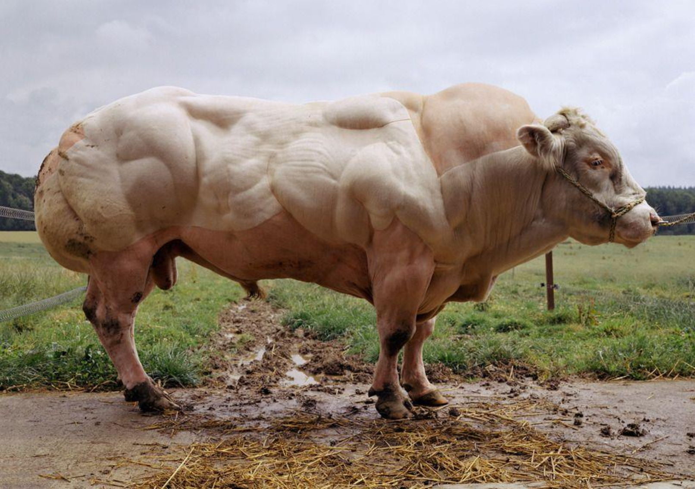
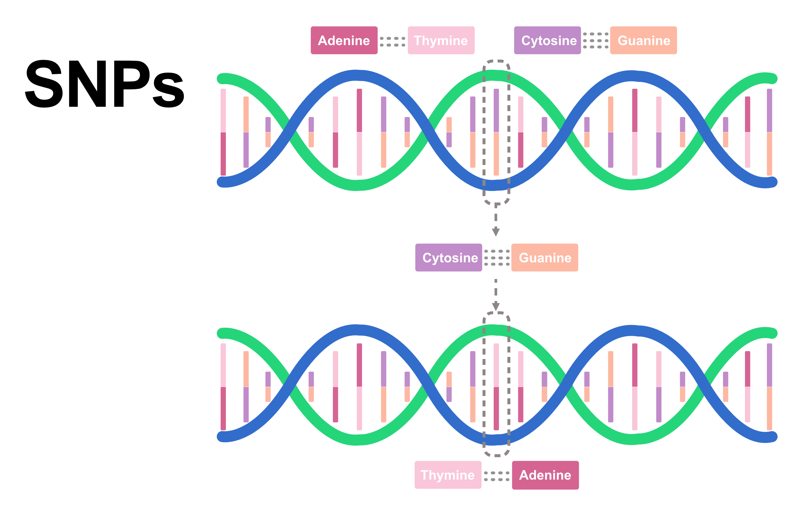
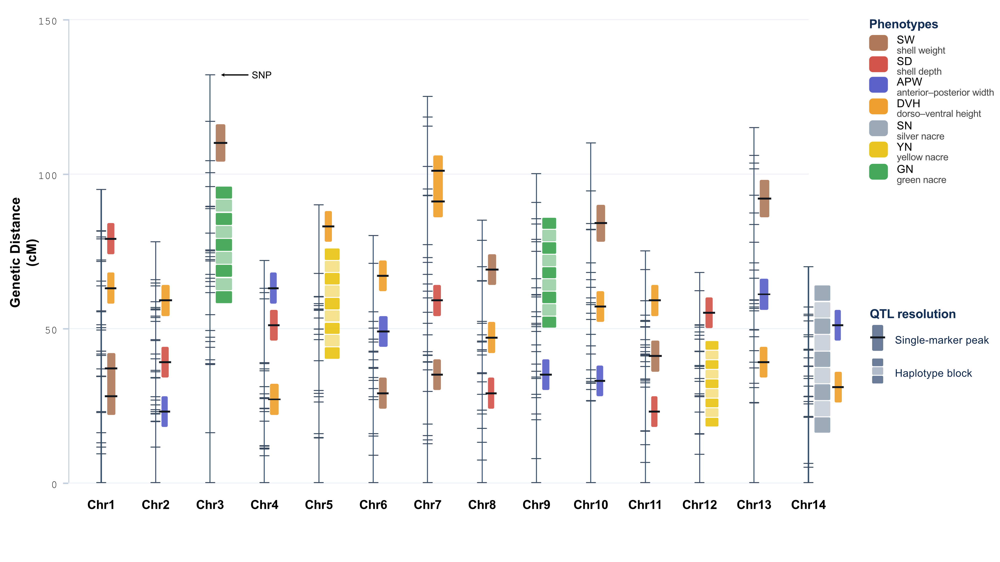

{fig-alt="Muscular cow"}

Modern dairy cows produce many times more milk than their ancestors did a century ago. Broiler chickens grow faster, and farmed salmon reach market size sooner. We might assume that these improvements come from the genetically modified organisms (GMOs) that people worry about. Yet, these advancements are actually the result of **selective breeding**.

Selective breeding aims to produce offspring with specific desired traits by choosing parents that already carry those traits. It can therefore only work with the traits and genetic variation that already exist in a population. This is why diversity matters. If a population holds no variation for a trait, there is nothing to select on.

## Challenges in traditional selection

Traditional selection chooses parents by looking only at their own visible traits. This works very well for simple traits, but it struggles with several important ones. Some traits appear late in life, and we must wait years before we can measure them. Some can only be measured after an animal is slaughtered, such as meat quality. Others are expressed in only one sex, such as milk yield in females.

Disease resistance is a good example. To find individuals that tolerate a certain disease, we have to expose them to it, and only the survivors are kept as candidate parents. This is wasteful, slow, and destructive. We may lose valuable individuals to the test itself, and the benefit of selection can take a very long time to arrive.

## Advances in molecular biology enable genomic selection

New molecular technologies, particularly genomic sequencing, can now read an individual's genome sequence. This has shifted breeding from traditional selection toward **genomic selection**. The statistical framework behind that shift was set out by [Meuwissen, Hayes and Goddard (2001)](https://doi.org/10.1093/genetics/157.4.1819), who showed that genetic merit can be predicted from genome-wide dense marker maps, and almost every genomic prediction method in use today still builds on that paper.

The idea rests on a simple assumption. Certain genetic variants in the genome are linked to certain traits. These variants are called [**quantitative trait loci (QTLs)**](https://doi.org/10.1146/annurev.genet.35.102401.090633), and they are passed from parents to offspring.

In practice, however, we never know exactly where the QTLs are. They may be many, and they may be scattered across the genome, so genotyping them directly is almost impossible.

Instead, we use genetic markers to point to QTLs. The most common markers are single-nucleotide polymorphisms (SNPs). A marker works because it sits physically close to a QTL on the chromosome. Because they are neighbours, the marker and the QTL tend to be inherited together as a package. This tendency is called linkage disequilibrium (LD).

{fig-align="center" width="672"}

A marker is like a signpost on a road. The signpost is not the destination itself, but because it always stands right next to the destination, it tells us the destination is there. In the same way, a marker is not the QTL, but it tells us a QTL is nearby.

{fig-alt="Marker and QTL in linkage disequilibrium" fig-align="center" width="842"}

So instead of measuring the trait itself, we can genotype an individual's markers and use them to predict how that individual will perform.

## How does genomic selection actually work?

Let’s imagine a really simple example first.

Suppose that we have two identical individuals: one has allele ATC and the other has AGC. The one who has ATC has a very low resistance to the disease, while the one with AGC has a very high resistance. Moreover, let’s suppose that this is true for all individuals in our population.

This means that for any individual that we will encounter, having the AGC will make them more resistant to the disease. Which, in turn, means that we can select those individuals to be the candidate parents and increase the frequency of the AGC allele in subsequent generations.

A single allele rarely controls a particular trait that we want. For most production animals, there are many QTLs that control some trait. This means that there are multiple alleles at different markers that contribute to that trait. So, we have to consider multiple markers, each of which may have only a minor impact.

To build a model that can predict the values of a trait, we first need to train it on a certain population and find out the impact of each marker. Such a population is called a [training population](https://doi.org/10.3168/jds.2008-1646) and, obviously, for it, we know the values of the trait (response variable) and the marker genotypes (predictor variables). After the model has been built, we can use the marker genotypes for any population (which includes those that we have used for training) to predict the value of the trait for each individual.

The model itself works by looking at the effects of the markers that were found during the training stage and sums up their small contributions to the overall effect. This total contribution of all markers is called **GEBV (genomic estimated breeding value),** and based on it, the individuals are selected.

With such a model, we can estimate the value of a trait without waiting for it to develop, without killing animals or doing expensive dissections to look at the internal structure. All we need is to read the SNPs for the genotype of each individual at birth and estimate the values of the trait based on these values and the model created earlier.

## Why genomic selection matters

Genomic selection is now used across many food industries, including livestock, poultry, crops, and aquaculture.

The effect is real. Selective breeding has improved these industries for many decades, and genomic selection has accelerated that progress in recent years. [Dairy cattle adopted it in the late 2000s](https://doi.org/10.1146/annurev-animal-021815-111422), and [aquaculture species such as salmon followed later](https://doi.org/10.1038/s41576-020-0227-y). As a result, production cycles have shortened and growth performance has improved.

It is also becoming available to smaller producers. The cost of genotyping an individual has fallen over time, which puts genomic selection within reach of industries that could not afford it before.

You might feel overwhelmed by the many technical terms I mentioned earlier. However, do not worry; the fundamentals of genomics-based selective breeding can be learned step by step. Start with the biological foundation below.

## 1. Biological fundamentals

This section introduces the biological concepts that connect inheritance, genetic variation, markers, and traits.

- [Genetic Fundamentals](biological-fundamentals/genetic-fundamentals.qmd)
- [Genetic variation and molecular markers](biological-fundamentals/genetic-variation-markers.qmd)
- [Genetic variation in populations](biological-fundamentals/population-genetic-variation.qmd)
- [Linkage, recombination, and linkage disequilibrium](biological-fundamentals/linkage-recombination-ld.qmd)
- [Haplotypes, phasing, and microhaplotypes](biological-fundamentals/haplotypes-phasing-microhaplotypes.qmd)
- [Pedigrees, relatedness, and inbreeding](biological-fundamentals/pedigrees-relatedness-inbreeding.qmd)

## 2. Mathematical fundamentals

This section develops the statistical and mathematical ideas needed to understand how genomic prediction models learn from phenotypes and markers.

1.  [Descriptive statistics](mathematical-fundamentals/descriptive-statistics.qmd)
2.  [Probability and random variables](mathematical-fundamentals/probability-random-variables.qmd)
3.  [Probability distributions](mathematical-fundamentals/probability-distributions.qmd)
4.  [Sampling and statistical uncertainty](mathematical-fundamentals/sampling-uncertainty.qmd)
5.  [Covariance and correlation](mathematical-fundamentals/covariance-correlation.qmd)
6.  [Vectors and matrices](mathematical-fundamentals/vectors-matrices.qmd)
7.  [Linear regression](mathematical-fundamentals/linear-regression.qmd)
8.  [Multiple regression and regularisation](mathematical-fundamentals/multiple-regression-regularisation.qmd)
9.  [Statistical models and estimation](mathematical-fundamentals/statistical-models-estimation.qmd)
10. [Linear mixed models](mathematical-fundamentals/linear-mixed-models.qmd)

## 3. Genomic prediction

This section connects quantitative genetics with the marker-based models used to predict breeding values and rank selection candidates.

1.  [Quantitative genetics: from phenotype to breeding value](genomic-prediction/quantitative-genetics.qmd)
2.  [From markers to genomic prediction](genomic-prediction/markers-to-prediction.qmd)
3.  [Genomic data encoding](genomic-prediction/genomic-data-encoding.qmd)
4.  [Genomic relationships](genomic-prediction/genomic-relationships.qmd)